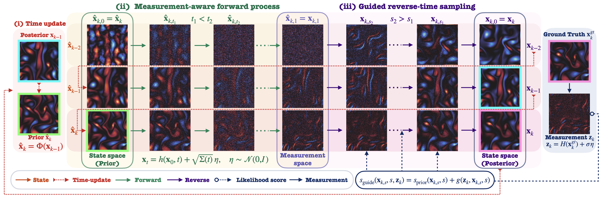

# MASF: Measurement-Aware Score-based Filter

[](https://arxiv.org/abs/2604.02889)

This repo contains the official implementation of **[Rethinking Forward Processes for Score-Based Nonlinear Data Assimilation in High Dimensions](https://arxiv.org/abs/2604.02889)**.


- The code and documentation are currently being organized and will be updated progressively.


## 1. Overview

<p align="center">
  
</p>


## 2. Results

### 2.1. Results at $128^2$ Resolution

<p align="center">
  
</p>

### 2.2. High-Resolution Results with Grid Mask Measurements

<p align="center">
  
</p>

## 3. Code Implementation

### 3.1. Code structure

```text
masf/
├── configs/                        
├── dynamics/                       # Kolmogorov flow
├── measurements/                   # Grid mask, Center mask, Sigmoid, Speed
├── methods/                        # EnKF, LETKF, SF, SSLS, MASF
├── models/                         # UNet, dual-UNet 
├── main.py                         # Run a single method
├── swap/                           
│   ├── run_tuning.py               # Run hyperparameter tuning phases
│   ├── run_post_eval.py            # Run post-evaluation and sensitivity analysis
│   ├── configs/                    
│   └── src/                        # Source code for tuning, post evaluation, and reports
├── utils/                         
├──README.md
└── requirements.txt
```

3.2. Installation
3.3. Usage
3.3.1. Single Experiment
3.3.2. Tuning
3.3.3. Post Evaluation
4. Tutorials 
5. Citation

```bibtex
@article{yoon2026masf,
  title={Rethinking Forward Processes for Score-Based Nonlinear Data Assimilation in High Dimensions},
  author={Yoon, Eunbi and Chang, Won and Kim, Donghan and Kim, Dae Wook},
  journal={arXiv preprint},
  year={2026}
}
```
## 6. Contact

For questions, please contact Eunbi Yoon at `eunbiyoon6286@kaist.ac.kr`.
